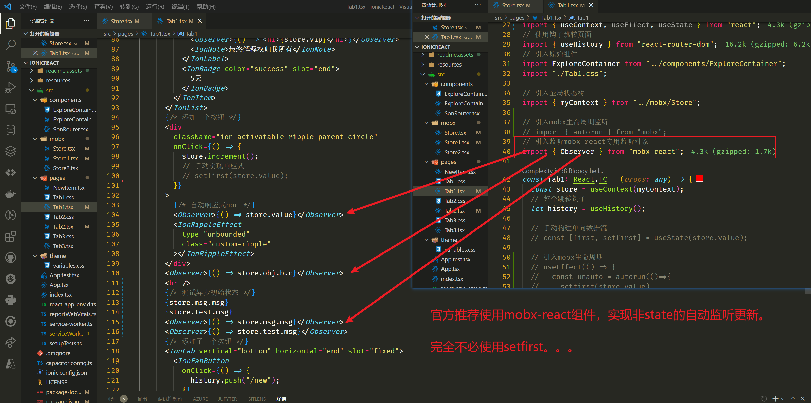

# ionic开发笔记

归根结底，它只是 React。Ionic React 使用开放的 Web 标准和内置的浏览器功能，因此它与数以百万计的 Web 库中的任何一个都兼容。

官网地址：https://ionicframework.com/docs

底层Android和IOS系统的接口，已经被Ionic框架封装。

内核主要由WebKit负责，所以它可以直接当成浏览器使用。

开发环境要求：

1.首推MacOs，毕竟Xcode只能在mac上开发。。。Windows和Linux只能开发安卓应用。

2.模拟器：

Android Studio 模拟Android

Xcode 模拟IOS

3.nodejs引擎

4.版本管理git

## 安装vscode插件

https://ionicframework.com/docs/intro/vscode-extension

推荐使用插件，命令行也行！

android调试桥，可以通过插件**ionic**配置。


## 基于react开发App

支持cdn开发

```
<script type="module" src="https://cdn.jsdelivr.net/npm/@ionic/core/dist/ionic/ionic.esm.js"></script>

<script nomodule src="https://cdn.jsdelivr.net/npm/@ionic/core/dist/ionic/ionic.js"></script>

<link rel="stylesheet" href="https://cdn.jsdelivr.net/npm/@ionic/core/css/ionic.bundle.css" />
```

支持react-cli and vue-cli等框架脚手架整合开发

https://ionicframework.com/docs/intro/cdn

**推荐使用ionic cli命令行进行直接开发**

```
# 安装脚手架，同样是基于脚手架开发的。
$ npm uninstall -g ionic
$ npm install -g @ionic/cli native-run

# 支持步次配置类似npm init
$ ionic start

# 安装模板，可以通过ionic start --help
# 选项卡tabs 侧边菜单sidemenu 单页空项目blank
$ ionic start myApp tabs --type react|vue|angular|ionic1

# 查看所有可用模板
ionic start --list

# web端调试
$ ionic serve
$ npm start
```

基础目录

```
src/
├── app/
├── assets/
├── environments/
├── theme/
├── global.scss
├── index.html
├── main.ts
├── polyfills.ts
├── test.ts
└── zone-flags.ts
```

```
src/
└── app/
    ├── app-routing.module.ts
    ├── app.component.html
    ├── app.component.spec.ts
    ├── app.component.ts
    └── app.module.ts
```

如果你使用了模板，那就是模板的目录。

shell命令：

https://ionicframework.com/docs/cli

```
# 提示选择生成的新功能
$ ionic generate
? What would you like to generate?
❯ page
  component
  service
  module
  class
  directive
  guard
```

### capacitor框架

为了构建Android and IOS 应用，我们还需要引入新的框架capacitorjs

https://capacitorjs.com/docs/getting-started/with-ionic

```
# 这个必须在原有ionic project的基础上，开启capacitor功能
$ ionic integrations enable capacitor
```

如果是原生的html+css+js的项目，则还需要参考：

https://capacitorjs.com/docs/getting-started

方式一：

```
# 直接创建新的capacitor项目：会问问题
$ npm init @capacitor/app
```

方式二：

```
# 在已有的老项目上，导入capacitor
$ npm i @capacitor/core
$ npm i -D @capacitor/cli

# 初始化：会问问题
$ npx cap init

# 安装平台包（前提是安装了xcode and Android studio）
$ npm i @capacitor/android @capacitor/ios
$ npx cap add android
$ npx cap add ios

# 同步到android and ios包中
npx cap sync
```

#### 基础插件

```
$ npm i @capacitor/app @capacitor/haptics @capacitor/keyboard @capacitor/status-bar
```

常用capacitor插件已放入本文[最后](#应用常用插件)。如图标，闪图，摄像头，蓝牙，分享，定位等等常用功能。

#### 添加移动平台到应用程序

```
$ ionic capacitor add android
$ ionic capacitor add ios
```

```
src/
├── xxx
└── xxxx
android/
├── xxx
└── xxxx
ios/
├── xxx
└── xxxx
```

#### 其他常用命令

- [`ionic capacitor add`](https://ionicframework.com/docs/cli/commands/capacitor-add)

添加平台包到根目录中

```
$ ionic capacitor add android|ios
```

- [`ionic capacitor build`](https://ionicframework.com/docs/cli/commands/capacitor-build?_gl=1*rumdbm*_ga*MTc3ODkxMzg2NS4xNjYzODU3NDgx*_ga_REH9TJF6KF*MTY2ODk3MzgzNC44Mi4xLjE2Njg5NzYyODAuMC4wLjA.)

将web资源赋值到 android|ios包中

```
$ ionic build
$ ionic capacitor build android
```

后续就是签名和打包了

- [`ionic capacitor run`](https://ionicframework.com/docs/cli/commands/capacitor-run)

执行模拟器。。。

```
$ ionic capacitor run [options]
```

https://ionicframework.com/docs/cli/commands/capacitor-run

可携带参数：例如

```
$ ionic capacitor run android -l --external
```

- [`ionic capacitor open`](https://ionicframework.com/docs/cli/commands/capacitor-open)

```
$ ionic capacitor open android
```

打开平台编辑器[具体方法](#构建原生App)：

1.生成签名文件

2.使用签名文件，构造app

#### **特殊命令**

合并命令：等价于ionic build + ionic capacitor build

```
$ ionic capacitor copy [options]
```

- [`ionic capacitor sync`](https://ionicframework.com/docs/cli/commands/capacitor-sync)

合并命令：等价于ionic capacitor copy + ionic capacitor update

```
$ ionic capacitor sync [options]
```

```
# 更新ionic的依赖项和插件
$ ionic capacitor update [options]
```

获取**ionic.config.json**中的配置值

```
$ ionic config get [options]
```

设置**ionic.config.json**中的配置值

```
$ ionic config set [options]
```

删除**ionic.config.json**中的配置值

```
$ ionic config unset [options]
```

### 路由IonReactRouter

这里我们使用官方二次封装的react-router路由。

https://ionicframework.com/docs/react/navigation

```
我们使用模板时，已经默认安装了
```


### 状态MobX

这里我们使用MobX进行全局状态管理。**天生Proxy，轻松实现深度监听。**


https://zh.mobx.js.org/README.html

```
# 只安装mobx，则我们需要自行构建响应式数据流
npm install --save mobx
# 推荐使用react-mobx or mobx-react-lite 选其一即可构建响应式数据流
# 支持class和function组件
npm i mobx-react
# lite只支持hook函数式组件
npm i mobx-react-lite
```

#### 创建可观察对象

**计算属性computed**

**观测属性observable**

**动作方法action**

**异步方法async**

三种方法：

class类方法：可以配置的相当细，但是麻烦！


function函数方法：常用方法


object对象方法


##### ★异步转同步

不需要额外的插件。


##### 用法：

**默认脚手架都是react**。毕竟vue的vuex和pinia更好用。。。

1.只用初始值(没必要用)

其实毫无意义，react-class组件直接定义state，react-function组件直接定义useState。

不管使用哪种方法，创建的可观察对象。

```
import store from "../mobx/store"
// 如果store是class类
const store = new store(*args)
store.value

// 如果store是function函数
const store = store()
store.value()

// 如果store是object对象
store.value
```

2.使用props进行传参（用的少）


3.使用context进行传参（推荐方法）

**实现了全局状态共享，但是组件内部还需要自行监听store的属性变化，才能重新渲染对应组件。**


★手动实现响应式组件

1.手动更新单向数据流


2.利用autorun进行自动更新


3.利用Observer进行自动更新（官方推荐）



#### react专用插件


##### ★HOC高阶组件context嵌套用法

这个是最常用的方案，实现全局组件的响应式。


##### 多Store合并


### 基于ionic的高阶HOC组件

#### root根组件App.tsx

**常规的react组件必须包装才能使用。**每个项目只能存在一个IonApp根组件


#### pages页面组件Tab.tsx

每个视图必须包含一个`IonPage`组件。没有它，页面转换将无法正常工作。有关详细信息，请参阅[IonPage 文档](https://ionicframework.com/docs/react/navigation#ionpage)。


#### 原生组件components


## 构建原生App

官方也支持cloud 需要先注册账号！

https://dashboard.ionicframework.com/personal/apps

这里我们就不使用组合命令了，一步步来：


### 包执行器npx语法

更好用的shell语法

```
$ npx ionic --help
$ npx ionic cap --help

举例：
# 安装安卓调试包
$ npx ionic cap add android
# 执行安卓调试，需要带参数
$ npx ionic cap run android
# 执行web调试，需要带参数
$ npx ionic serve
```

## 应用常用插件

https://capacitorjs.com/docs/plugins

https://capacitorjs.com/docs/cordova/migrating-from-cordova-to-capacitor

**这里有巨坑！！**

官方文档更新的不够及时，很多插件其实已经被弃用，npm install xxx 存在大量的坑。

| 插件      | 状态                 | 官网                                   |
| --------- | -------------------- | -------------------------------------- |
| Capacitor | 官方维护插件         | https://capacitorjs.com/docs/apis      |
|           | 社区维护插件         | https://github.com/capacitor-community |
| Cordova   | 官方不推荐。依然兼容 | https://cordova.apache.org/plugins/    |

### 应用图标

坑点：依赖包需要挂梯子！Dependent: [sharp](https://www.npmjs.com/package/cordova-res) [libvips](https://github.com/libvips/libvips)

https://github.com/ionic-team/capacitor-assets

```
# 不推荐
npm install -g cordova-res
# 官方推荐
npm install @capacitor/assets
```

这里我们使用简易模式：

```
# 项目root中创建assets/resources文件夹
assets/resources
├── logo.png/icon.png
└── logo-dark.png/icon-dark.png
src/
├── xxx
└── xxxx
public/
├── xxx
└── xxxx
...
```

```
# 执行构筑命令
npx capacitor-assets generate --iconBackgroundColor '#eeeeee' --iconBackgroundColorDark '#222222' --splashBackgroundColor '#eeeeee' --splashBackgroundColorDark '#111111'
```

```
--iosProject
iOS项目的路径（默认ios/App）
--androidProject
Android 项目的路径（默认android）
--assetPath <path>
项目资产目录的路径。默认情况下将按顺序检查"assets"和目录"resources"
--iconBackgroundColor
为光模式生成图标层时使用的背景颜色（十六进制值）（默认#ffffff）
--iconBackgroundColorDark
为暗模式（支持时）生成图标层时使用的背景颜色（十六进制值）（默认#111111）
--splashBackgroundColor
生成初始屏幕时使用的背景颜色（十六进制值）（默认#ffffff）
--splashBackgroundColorDark
为暗模式生成启动画面时使用的背景颜色（十六进制值）（如果支持）（默认#111111）
--logoSplashTargetWidth
从单个徽标文件生成初始屏幕时将徽标设置为的特定宽度（默认情况下不使用，徽标按比例缩放为初始屏幕的百分比，请参阅--logoSplashScale）
--logoSplashScale 
从单个徽标文件生成启动画面时应用于徽标的比例乘数（默认值0.2：）
--ios
明确运行 iOS 资产生成。使用平台标志使平台列表独占。
--android 
显式运行 Android 资产生成。使用平台标志使平台列表独占。
--pwa
(默认)显式运行 Android 资产生成。使用平台标志使平台列表独占。
```

自定义模式：

```
assets/
├── icon-only.png
├── icon-foreground.png
├── icon-background.png
├── splash.png
└── splash-dark.png
```

```
npx capacitor-assets generate --pwa
```

### 闪图广告

一般用作开屏广告！

```
npm install @capacitor/splash-screen
```


### 微信sdk


### 支付宝sdk


### 云闪付sdk


## 创建插件

